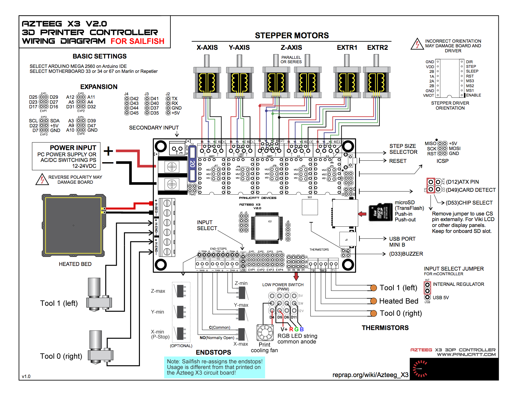
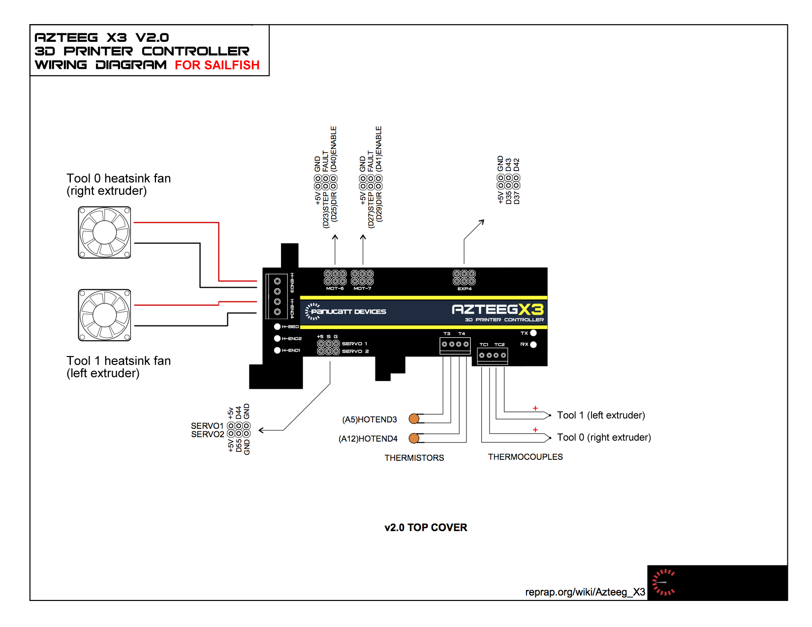
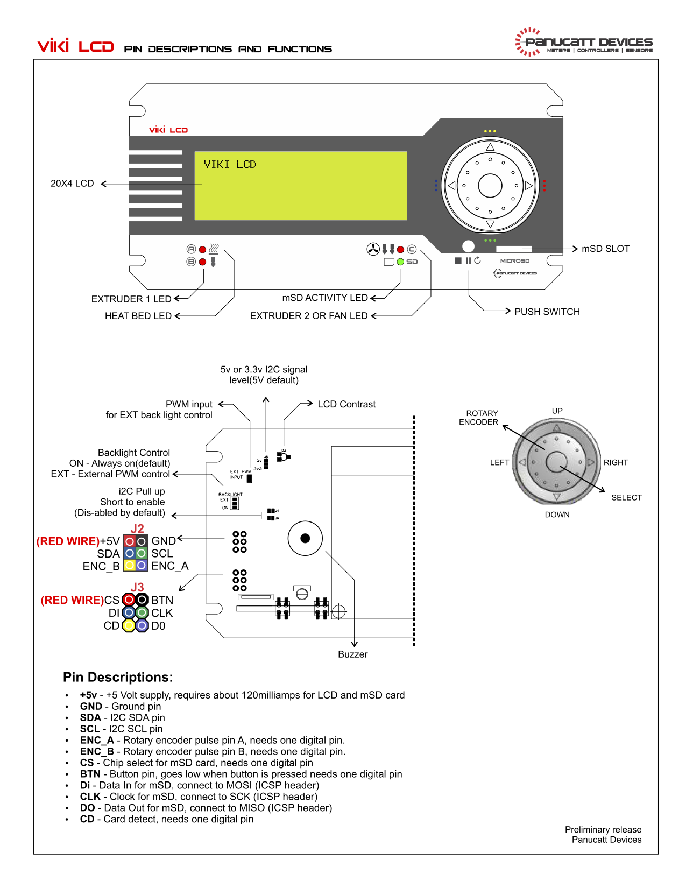

# Sailfish for Azteeg X3 V2.0
29 July 2015

All images are Copyrighted by Panucatt Devices LLC.
Azteeg X3 V2.0 images are adapted from Panucatt Devices LLC documentation.
ViKi 1 wiring images are directly from Panucatt Devices LLC documentation.

## Introduction
Sailfish is presently in beta test on Panucatt Azteeg X3 V2.0 electronics.
[Sources for Sailfish](https://github.com/jetty840/Sailfish-MightyBoardFirmware/)
are kept at github.  Sailfish is derived in part from the RepRap Generation 4
firmware, MakerBot's MightyBoard firmware, Marlin, Sprinter, and grbl.

It is important to realize the Sailfish is primarily designed to squeeze
the most performance possible out of 8 bit, 16 MHz AVR microprocessors.
To that end, it is optimized for the Replicator 1 and Replicator 2 series
of hardware.[^1]  Sailfish is *not* intended to be a highly portable.
As it targets a very narrow range of hardware, it doesn't pay as much
attention as other firmwares to ease of configuration for arbitrary
hardware.  Moreover, some of the optimizations assume "sane" steps/mm
values.  (Yes, that statement may be construed as prejudiced and perhaps
even obnoxious.)  Sailfish will not be a good fit to printers with more
than 800 steps/mm for the Z axis.[^2]  Nor a good fit for printers with
much beyond 200 steps/mm for any other axis: the fixed point arithmetic
which Sailfish uses can and will start exhibiting overflows at high step
rates or accelerations when combined with axes with large numbers of
steps per millimeter of travel.

Sailfish on Azteeg electronics is chiefly of note to owners of existing
Replicator 1 and 2 series printers and who are interested in trying out
new electronics; electronics which can continue to run Sailfish while also
offering support for Marlin or Repetier.  This port of Sailfish to the
Azteeg X3 opens a new vista to the community of people using MakerBot-style
printers; a community of approximately 1 million 3D printers.[^3]

Some important differences from Marlin and other RepRap firmwares are

* Sailfish's LCD UI is a five-button UI: UP, DOWN, LEFT, RIGHT, and
CENTER/OK/SELECT.  On the ViKi 1, the rotary encoder is also supported
and acts as an up and down scroll.  Use of the LCD UI is described in
[Section 3.2](http://www.sailfishfirmware.com/doc/ui-main-menu.html#x12-110003.2)
of the Sailfish documentation.

* For a slight performance boost, Sailfish still uses the RepRap Sanguino
Gen 3 communications protocol (aka,
[Sanguino3 Gcode](https://en.wikipedia.org/wiki/Sanguino3_G-Code), S3G).
Sailfish does not directly consume gcode; gcode *must* first be translated
to S3G or
[extended S3G, X3G](https://github.com/makerbot/s3g/blob/master/doc/s3gProtocol.md).
This may be done with Dr. Henry Thomas' open source
[GPX](https://github.com/dcnewman/GPX/releases), with the
somewhat defunct 
[ReplicatorG 40 - Sailfish](http://www.thingiverse.com/thing:32084/#files),
with Mark Walker's
[GPX-based plugin for Octoprint](https://github.com/markwal/OctoPrint-GPX),
or with either of the proprietary slicers MakerBot MakerWare/Desktop or
[Simplify 3D's Simplify 3D slicer](https://www.simplify3d.com/)
(which incorporates GPX).  Gcode files placed on SD cards will be ignored
by Sailfish: only directory folders and files with the (case insenstive)
extensions `.s3g` or `.x3g` will be honored.[^4]

* For the most part, there are no gcode commands to set printer parameters.
Briefly, Sailfish supported some but they were removed to save code space
in the cramped ATmega 1280s which MakerBot used.[^5]  Printer parameters are
set through a combination of the LCD UI and ReplicatorG 40 - Sailfish.
Not everything can presently be set through the LCD UI: another side effect
of catering to the ATmega 1280.  And not everything can be set via
ReplicatorG, but that's usually just because ReplicatorG lags behind changes
in Sailfish.  There are plans to update the Sailfish LCD UI on ATmega 2560
systems to provide access to all firmware parameters (such as is possible
on Thing-o-Matics).

* The [acceleration parameters in Sailfish](http://www.sailfishfirmware.com/doc/parameters-acceleration.html#x21-590004.3)
should be familiar to Marlin users. In place of the "jerk" parameters,
Sailfish uses limits on maximum speed changes along each axis.  Intentionally
missing are Marlin/grbl's maximum normal acceleration and maximum
extrusion-only acceleration parameters.[^6]

## Documentation
Fairly extensive documentation for Sailfish may be found at the
[Sailfish documentation site](http://www.sailfishfirmware.com/doc/index.html).
 As of this writing that documentation has not yet been updated with
information on Azteeg X3 support.

## Wiring
Wiring an Azteeg X3 V2.0 board for Sailfish is, for the most part,
straightforward.  In the description that follows, the terminal/connection
references are as per the wiring diagrams below and available as the files
[x3_v2_wiring-1.png](https://github.com/jetty840/Sailfish-MightyBoardFirmware/blob/master/docs/azteeg-x3/x3_v2_wiring-1.png)
and [x3_v2_wiring-2.png](https://github.com/jetty840/Sailfish-MightyBoardFirmware/blob/master/docs/azteeg-x3/x3_v2_wiring-2.png).
_These diagrams have been modified for Sailfish._ They do differ in some
particulars from the "standard" Azteeg X3 V2.0 wiring diagrams.

* Endstops: XY-min Sailfish builds
	* All endstops wired as per the Azteeg silkscreen.
	* By default the endstops are assumed HIGH when inactive and LOW when
	triggered.  This can be changed via RepG's "Onboard Preferences".

* Endstops: XY-max Sailfish builds
	* Z minimum and Z maximum are as per the Azteeg silkscreen.
	* Since many MakerBot style printers use X and Y maximum homing but
	the Azteeg only provides terminals for minimum endstops, Sailfish
	switches the min and max endstops for X and Y.  To hook up X and Y max
	endstops, connect to the "Xmin"" and "Ymin" terminals on the Azteeg.
	* By default the endstops are assumed HIGH when inactive and LOW when
	triggered.  This can be changed via RepG's "Onboard Preferences".

* Pause Stop switch (P-Stop, optional):
	* For either builds, XY-min or XY-max, wire the P-Stop to the
	position silkscreened as "Xmax" on the Azteeg X3 board.
	* P-Stop switches default to activating when they go LOW.

* Motor wiring
    * Wire as you normally would.
    * ReplicatorG 40 - Sailfish has options in the "Onboard Preferences"
      window to invert the direction of travel for each motor.  Of course,
      you can also reverse the wiring for the same effect.  Sailfish's
      LCD UI does have a jog utility; see
      [Section 3.7.12](http://www.sailfishfirmware.com/doc/ui-utilities-menu.html#x17-480003.7.12)
      of the Sailfish documentation.

* Tool 0 (right extruder)
	* Heater: wire to the main board's first hot end terminals, H-END.
	These are the two terminals closest to a board corner.
	* Thermistor: wire to the T0 thermistor terminals if using a thermistor.
	* Thermocouple: wire to the expansion board's TC1 terminal if using a
	thermocouple.  Negative is the outermost (leftmost) terminal.
	* Heatsink cooling fan: if using an extruder heatsink cooling fan, wire to
	the cover board's H-END 3 terminals.  Positive is the outermost terminal.
	Turns on when the extruder temperature is at or above 50C.  (Configurable
	via EEPROM with ReplicatorG.)

* Tool 1 (left extruder; optional)
 	* Heater: wire to the main board's second hot-end terminals, H-END.
 	These are the two terminals closest to the heated bed terminals, H-BED.
	* Thermistor: wire to the T1 thermistor terminals if using a thermistor.
	* Thermocouple: wire to the expansion board's TC2 terminal if using a
	thermocouple.  Postive is the outermost (rightmost) terminal.
	* Heatsink cooling fan: if using an extruder heatsink cooling fan, wire to
	the expansion board's H-END 4 terminals. Negative is the outermost terminal.
	Turns on when the extruder temperature is at or above 50C.  (Configurable
	via EEPROM with ReplicatorG.)
	* When adding a second extruder, from the
	[LCD UI](http://www.sailfishfirmware.com/doc/ui-utilities-menu.html#x17-340003.7.4.6)
	or ReplicatorG, you can set the extruder count to 2.  Power cycle the
	printer after changing this setting.  You will then want to calibrate the
	[X and Y toolhead offsets](http://www.sailfishfirmware.com/doc/ui-utilities-menu.html#x17-470003.7.11).

* Heated bed (optional)
	* Connect heater PCB to the heated bed terminals, H-BED.
	* Thermistor: connect to the TBED thermistor terminals.
	* If you do not use a heated bed, then from the LCD UI or RepG, you can
	disable the use of a heated bed.  See
    [Section 3.7.4.8](http://www.sailfishfirmware.com/doc/ui-utilities-menu.html#x17-360003.7.4.8)
    of the Sailfish documentation. Power cycle the printer after changing
	this setting.
	
* Print cooling fan (optional)
	* Connect to D4 column of "LOW POWER SWITCH (PWM)" terminals.  Note
	that S3G/X3G does not accomodate PWM fan speed control.  A print cooling
	fan is either full on or full off.  However, Sailfish does have an
	EEPROM setting (accessible from the LCD UI) to set a 0 - 100% duty
	cycle to use when the print cooling fan is enabled.
	
* RGB LEDs (optional)
	* Sailfish presently builds for the Azteeg assuming common anode LED
	strips.  Wire the +12/+24V common wire to the +12V terminal at D5,
	D6, or D11 on the "LOWER POWER SWITCH (PWM)".  Then wire the red strand
	to the SW position for D5; green to the SW position for D6; blue to the
	SW position for D11.  To enable use of the LEDs, use the "General
    Settings" submenu of the Utilities LCD UI menu to select a colour
    other than OFF.  White is a good choice.  The LEDs may also be enabled
    using the "Onboard Preferences" window of ReplicatorG 40 - Sailfish.
	
* ViKi 1 LCD UI (optional, but strongly recommended)
	* Wire as per Panucatt's
    [viki_wiring_diagram.pdf](http://files.panucatt.com/datasheets/viki_wiring_diagram.pdf).
	* Follow the Azteeg X3 wiring; the "button pin" is presently not supported.
	Ideally, it would be used for the Pause-Stop function but future support
	for the ViKi 2 may use it for a LEFT button (exit menu).
	
	
	

## Installing Sailfish
Before installing Sailfish, decide if you will be using XY-min homing or
XY-max homing.  While all endstops are "live" in Sailfish, there are biases
compiled in to Sailfish:

* Homing and leveling scripts biased to either XY-min or XY-max homing
* Default X and Y home positions set to either (0,0) for XY-min or
 large, positive values aimed at Replicator 1 style printers.
* When the build platform is cleared for a "cancel" or "pause" operation,
 it is moved to the home positions _plus_ 5mm for XY-min homing or moved
 to the home positions _less_ 5mm for XY-max homing.  Having a pause do
 the wrong thing will cause a loss of registrating and inability to
 successfully restart the print.

To install Sailfish, refer to the [Installing Sailfish documentation](http://www.sailfishfirmware.com/doc/install-installing.html).
However, since the Azteeg port Sailfish is still in beta test, you must
provide ReplicatorG with a different download URL,

1. With ReplicatorG running, but not connected to your printer, go to the
Preferences submenu which appears under the File menu on Windows and Linux
and under the ReplicatorG menu on OS X.

2. In the Preferences window, click on the Advanced tab.  Set the "Firmware
update URL" to

    `http://jettyfirmware.yolasite.com/resources/beta/firmware.xml`

   and then close the Preferences window.
   
3. You may need to exit and restart ReplicatorG to get it to then download the
beta firmwares.  You should see it logging the downloads in the logging section
at the bottom of the main window.[^7]

4. Note that you do not need to press any reset button on the Azteeg when
downloading firmware to it.

5. After installing Sailfish, it is highly recommended that you do a full reset
on the EEPROM.  Sailfish will check the first couple of bytes of the EEPROM
for version information and do a full reset if what it finds does not match
expectations.  However, it might be best to be certain.  From the LCD UI this
can be done from the EEPROM section of the Utilities menu using the "Erase
EEPROM" selection.  See the
[Section 3.7.18](http://www.sailfishfirmware.com/doc/ui-utilities-menu.html#x17-540003.7.18)
of the Sailfish documentation for details.  Alternatively, ReplicatorG 40 -
Sailfish may be used.  This is done with the "Reset motherboard entirely"
button of the "Onboard Preferences" window accessed via the Machine menu.
Regardless of the means you use to reset the EEPROM, do so before comissioning
the printer; otherwise, EEPROM settings effected whilst commissioning will be
erased and reset to their defaults.

If you prefer to use `avrdude` directly, you may do so.  However, you will
need to use ReplicatorG 40 - Sailfish when commissioning your printer. As of
this writing, the current beta of Sailfish for the Azteeg is r1600 and the
`.hex` files may be downloaded from

* Cartesian Core-XY: [azteeg-x3-corexy-Sailfish-v7.8.0-r1600.hex](http://jettyfirmware.yolasite.com/resources/beta/firmware/azteeg-x3-corexy-Sailfish-v7.8.0-r1600.hex)
* Standard Cartesian: [azteeg-x3-Sailfish-v7.8.0-r1600.hex](http://jettyfirmware.yolasite.com/resources/beta/firmware/azteeg-x3-Sailfish-v7.8.0-r1600.hex)

If using `avrdude` via the USB port of the Azteeg, then the pertinent
`avrdude` switches are `-p m2560`, `-c stk500v2`, and `-b 115200`.

## Commissioning

### Axis lengths, maximum axial speeds, steps/mm values
To commission a printer with Sailfish, you need ReplicatorG 40 - Sailfish
("RepG") to upload the lengths of each axis, maximum axial speeds, and axial
steps/mm values.  It is important that you use RelicatorG 40 - Sailfish and
not the old ReplicatorG&nbsp;0040 which MBI abandoned in November 2012. 
Before abandoning it, MakerBot accidentally introduced some bugs in it which,
for any firmware reporting a version of 7.0 or later, will corrupt some
EEPROM settings.

ReplicatorG 40 - Sailfish may be downloaded from the
[Sailfish Thing](http://www.thingiverse.com/thing:32084/#files) at
[thingiverse.com](http://thingiverse.com).

Before running RepG, edit a copy of [this sample machine definition file](https://raw.githubusercontent.com/jetty840/Sailfish-MightyBoardFirmware/master/docs/azteeg-x3/azteeg.xml)
and save the result in the directory `~/.replicatorg/machines/azteeg.xml`.
(If you have never run RepG before, then you will need to first create those
directories.)

	<machine>
	  <name>My Azteeg X3</name>
	  <geometry type="cartesian">
	    <axis id="x" length="200" maxfeedrate="18000" homingfeedrate="2500" stepspermm="88.89" endstops="max"/>
	    <axis id="y" length="200" maxfeedrate="18000" homingfeedrate="2500" stepspermm="88.89" endstops="max"/>
		<axis id="z" length="210" maxfeedrate="600" homingfeedrate="600" stepspermm="400" endstops="min"/>
		<axis id="a" length="100000" maxfeedrate="1600" stepspermm="96.28" endstops="none"/>
		<axis id="b" length="100000" maxfeedrate="1600" stepspermm="96.28" endstops="none"/>
	  </geometry>
	  <driver name="mightysailfish">
	    <rate>115200</rate>
	  </driver>
	  <tools>
	    <tool name="extruder" model="Mk8" diameter="0.4" stepper_axis="a" index="0" type="extruder"
		  motor="true" fan="true" heatedplatform="true" motor_steps="3200" default_rpm="3" heater="true"/>
		<tool name="extruder" model="Mk8" diameter="0.4" stepper_axis="b" index="1" type="extruder"
		  motor="true" fan="true" heatedplatform="true" motor_steps="3200" default_rpm="3" heater="true"/>
		</tools>
		<bookend dualstart="machines/replicator/Dualstrusion_start.gcode"
		  start="machines/replicator/Dual_Head_start.gcode"
		  end="machines/replicator/Dual_Head_end.gcode"/>
	</machine>

**In the file, only edit the `<axis>` elements in the `<geometry>`
section.** Do not edit the other sections: the information in them must be
present but will not be sent to Sailfish.  __Leave them alone__: mistakes in
those sections can lead to mysterious RepG hangs.

In the `<axis>` elements, the only fields you need to change are

1. `length="..."` specifies the length of the axis in units of millimeters.
 The firmware only cares about the length of the Z axis.  It uses that
 value when clearing the platform during a print pause.
2. `maxfeedrate="..."` specifies the maximum feedrate for that axis in units
 of millimeters per minute.  This is used by the firmware to limit top speeds
 when the printing speed is dynamically changed during a print.  When
 converting gcode to X3G, the converter itself will impose maximum feedrates.
 As such, the firmware only needs to know the maximum feedrates for when it
 is [told to increase them past those in the X3G
 commands](http://www.sailfishfirmware.com/doc/ui-print-monitor-menu.html#x14-170003.4.4).
3. `stepspermm="..."` is the number of microsteps required to move the axis
 one millimeter.  Knock yourself out with high precision values.  They will
 be stored as single precision floating point values in EEPROM.  The firmware
 uses these values when clearing the build platform during a pause -- it will
 move within 5mm of each endstop.  The values are also used to convert between
 units of steps per second and millimeters per second.  I.e., used to impose
 kinematical constraints such as maximum rates of acceleration.

Do provide information for two extruders, axes A and B, even if you will only
be using a single extruder.

Once you have edited the XML file and saved it to
`~/.replicatorg/machines/azteeg.xml`, launch ReplicatorG.  When ReplicatorG 
is running, go to the "Machine Type (Driver)" submenu of the Machine menu.
Select the machine "My Azteeg X3".  If you do not see that machine listed,
then you likely mis-edited the XML file causing it to be syntactically
invalid XML.  Correct the mistake and try again.  Each time you change the
XML file, you must exit and restart RepG which will only load the XML files
once, at startup.

Once "My Azteeg X3" is selected, connect to your printer over USB:

1. Connect the USB cable between your printer and your computer.
2. Power the printer on.
3. In ReplicatorG, use the "Connection (Serial Port)" submenu of the Machine
 menu to select the comms port for your printer.  If RepG was running before
 you powered your printer on, then use "Rescan serial ports" choice of the
 submenu.  Then, once the ports have been scanned, select the port.
4. Now, click the "Connect" icon in RepG: it's the second icon from the
 right.
5. Once connected, RepG will query the printer's and automatically upload
 any machine settings from the XML file which differ with those in the
 printer's EEPROM.
6. You can also use the "Onboard Preferences" submenu of the Machine menu
 to see and change settings in the EEPROM.  For example, the maximum
 acceleration and speed change settings.
 
See [Section 6.4.2.2 of the Sailfish documentation](http://www.sailfishfirmware.com/doc/install-configuring.html#x35-940006.4.2.2)
for an example of using RepG to connect to a printer.
[Chapter 4](http://www.sailfishfirmware.com/doc/parameters.html#x18-560004)
of that documentation describes all the firmware parameters available.

### Stepper currents
If you will be using stepper drivers which do not support the Azteeg X3's
digital potentiometers ("digipots"), then manually set the current limits
for your drivers.  If, however, you do use drivers which support the Azteeg's
digipots, then

1. **For the Panucatt SD8825 stepper drivers:**  To set a current limit Cl in
Amps, use the integer-valued digipot setting n given by

	n = 256 * Cl / 2.4 A

    For other stepper drivers, you will need to use a different derivation.
    See the [Sailfish source code](https://github.com/jetty840/Sailfish-MightyBoardFirmware/blob/master/firmware/src/MightyBoard/Motherboard/boards/azteeg_x3/DigiPots.cc#L20)
    for guidance.
    
2. The G130 gcode command may be used to set, for one or more axes, an integer
value between 0 and 255, inclusive,

    `G130 Xn Yn Zn An Bn`

    where `n` is the value of n appropriate to the associated axis.  For
    example, to set current limits of 1.2A for X, Y, and Z and 0.72A for A
    and B, use the gcode command
    
    `G130 X128 Y128 Z128 A76 B76`
    
    Any combination of axes may be specified; it's not required that all five
    axes be specified in the same command.

3. **If you require digipot values larger than 127**, then you must use
[GPX 2.2.1](https://github.com/dcnewman/GPX/releases/tag/v2.2.1) or later.
Prior versions of GPX limited the digipot settings to a maximum value of 127.

4. Default values for the currents may also be saved in EEPROM.  Sailfish will
assert those values at startup, obviating the need to specify them in gcode.
This may be done using the "Onboard Preferences" window of ReplicatorG 40 -
Sailfish. That window is accessed from the Machine menu after connecting to
the printer over USB.  Look in the VREF/Homing tab of that window. See
[Section 6.4.2.2](http://www.sailfishfirmware.com/doc/install-configuring.html#x35-940006.4.2.2)
of the Sailfish documentation for an example showing how to use the "Onboard
Preferences" window. 

### Tool count and heated bed
Sailfish defaults to assuming you have one extruder, Tool 0, and a heated
bed.  To change these, you can either use ReplicatorG or the LCD UI:

* From the LCD UI, select the Utilties menu.  From Utilites, select "General
Settings". **See
[Section 3.7.4](http://www.sailfishfirmware.com/doc/ui-utilities-menu.html#x17-280003.7.4)
for instructions on how to use this menu.**  Set the "Extruder Count" to 1
or 2 and set the "HBP Installed" to YES or NO.  After changing either or both
of these, power cycle your printer. See
[Sections 3.7.4.6](http://www.sailfishfirmware.com/doc/ui-utilities-menu.html#x17-340003.7.4.6)
and [3.7.4.8](http://www.sailfishfirmware.com/doc/ui-utilities-menu.html#x17-360003.7.4.8)
of the Sailfish documentation for further information.

* From ReplicatorG 40 - Sailfish, use the "Onboard Preferences" window accessed
from the Machine menu.  That menu only appears when connected to the printer
over USB.  See
[Section 6.4.2.2](http://www.sailfishfirmware.com/doc/install-configuring.html#x35-940006.4.2.2)
of the Sailfish documentation for an example showing how to use the "Onboard
Preferences" window. 

### Thermistor types
Presently, Sailfish on Azteegs defaults to assuming that Epcos 100K
thermistors (Marlin table 6) are used for all temperature sensors (bed,
tool 0, and tool 1).  You must use the LCD UI to select different thermistor
tables (per sensor) or to use a Type-K thermocouple for either or both of
the extruders.  RepG has not yet been updated to make these changes to your
printer.

From the LCD UI,

1. Select the Utilties menu from the top-level menu.
2. With the DOWN button, scroll down to the "Temp Sensor Types" item.  It will
be down a screen or two.
3. Select "Temp Sensor Types" with the CENTER button.  (Often referred to as
the "M" button dating back to MakerBot's Replicator 1 which had an "M" on that
button.)
4. Scroll down or up with the DOWN and UP buttons to see the different
thermistor choices.  The numeric values shown as part of the terse
description/name is the Marlin thermistor table number.  Presently tables 1
through 7 are available.  To use a thermocouple with either of the extruders,
use the "0. K Thermocouple" choice.  After scrolling to the desired choice,
press the CENTER button.  As you make your choices, you will progress from
Tool 0 (right/primary extruder) to Tool 1 (left extruder) to the heated bed.
Once you press the CENTER button for the bed thermistor, the settings will
be effected and you will be returned to the Utilities menu.  If you press
the LEFT button at any time, you will exit the "Temp Sensor Types" menu and
your choices will be discarded.

Note that the "Temp Sensor Types" menu will always set choices for all three
temperature sensors regardless of whether you have enabled or disabled Tool 1
or the heated bed.

	
## Configuring GPX
This documented is not intended to be a GPX usage guide.  Unfortunately, GPX
has very little documentation.  GPX is a command line utility and, with the `-?`
switch will provide some information.  Sample configuration files -- `.ini`
files -- for all the built in machine definitions are kept in the
[GPX releases, the most current of which is v2.2.1](https://github.com/dcnewman/GPX/releases/tag/v2.2.1).

The primary purpose of GPX is to translate gcode to X3G.  To that end, GPX
needs to know the steps/mm settings for each axis as well as the maximum
speed for each axis (as it will impose speed limits).

If your printer has GT2 18 or 17 tooth pulleys, then you can use one of the
built in machine definitions: the Replicator 1 series uses 17 tooth pulleys
while the Replicator 2 series, 18 teeth.  If neither of those apply, then
you will need to supply your own `.ini` file.  A minimal but complete enough
`.ini` file is illustrated below,

	[x, y]
	steps_per_mm = 88.888889
	max_feedrate = 18000

	[z]
	steps_per_mm = 400
	max_feedrate = 1170

	[a, b]
	steps_per_mm = 96.2752
	max_feedrate = 1600
	has_heated_build_platform = 1
	
The `max_feedrate` fields specify the maximum feedrate for the axis in units
of millimeters per minute.

If your printer has only a single extruder, omit the `, b` in `[a, b]` (i.e.,
change `[a, b]` to `[a]`).  Otherwise, X3G commands to wait for Tool 1 to 
heat up will be inserted into the X3G.  (Since it won't have a target
temperature, the won't have any effect, but best to omit them to begin with.)

To instruct GPX to use your custom configuration file, use a command of the
form

	gpx -c my_machine.ini -r -p my-gcode.g
	
where

* `my_machine.ini` is the name of your `.ini` file
* `my_gcode.g` is the name of your gcode file.  (The file extension can be
whatever you want).
* `-r` tells GPX to assume RepRap-style gcode.
* `-p` tells GPX to generate approximate "percentage complete" markers and
place the into the X3G for display on the LCD screen during the print.

GPX will produce as output a file named `my-gcode.x3g`.

If you will be using Octoprint, you will need to put your `.ini` file onto the
Octoprint server and configure the GPX plugin to use it.  (As of this writing,
I do not know offhand how that is done.)

## Footnotes

[^1]: There's also a version optimized to Cupcakes and Thing-o-Matics.
[^2]: Break long Z moves into multiple moves if using a high resolution Z axis. However, even that may still cause difficulty.
[^3]: While MakerBot has sold several hundred thousand Replicator 1 and 2 series printers, the Asian clone manufacturers have reportedly sold two to three times the number of Replicator 1 clones.
[^4]: Note that Sailfish does support FAT-32 in addition to FAT-16.
[^5]: Using an ATmega 1280 saved about $1 US per motherboard.  Incredibly shortsighted and, frankly, unforgivable.
[^6]:  If you carefully look at Marlin and grbl sources, you will see that the maximum normal acceleration ("mna") and maximum extrusion-only acceleration (mea)  parameters have no effect: they are overridden by the per-axis maximum accelerations once they are applied.  Thus mna and mea serve no purpose.  Well, that's almost entirely true: should the mna or mea be set to a value smaller than a per-axis maximum acceleration, then mna or mea will prevail for that axis.  However, the same effect can be had by simply reducing that axial maximum acceleration.  So again, mna and mea do not serve a useful purpose.  They appear to be an artifact from grbl's early days before it had per-axis maximum accelerations.
[^7]: Note that you must be using revision 30 (r30) or later of ReplicatorG 40 - Sailfish for downloads to work owing to changes in the CloudFlare web server caching service used by yola.com.
